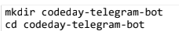

# Come Creare un Bot Telegram  
**Come prima cosa dobbiamo classificare due tipologie di bot**  

Telegram ha due tipi di bot: chat bot e inline bot. I chat bot usano i comandi (come /start , /help ) per
interagire tra utenti. Gli inline bot possono invece essere chiamati da qualsiasi parte e aiutano gli utenti a
trovare e inviare contenuti dal vostro bot a qualsiasi chat che desiderano. In questa sede ci occupiamo dei
chat bot. 
#### Per la creazione del bot useremo il seguente workshop: 
- Windows: https://nodejs.org/dist/v6.6.o/node--v6.6.o--x64msi
- MacOS: http://nodejs.org/dist/v6.6.o/node--v6.6.o.pkg
- Linux: dovreste già sapere come procurarvi Node.js

**NOTA BENE:** _prima di creare il bot, bisogna creare un account telegram per farlo basta andare da [telegram.org/dl](https://desktop.telegram.org/) e seguire le istruzioni per la creazione._
#### Creare le directory del Progetto
  

Adesso che abbiamo una directory per il nostro bot Telegram, abbiamo bisogno di un _package.json_ , se
non siete neofiti di Node.js, non è necessario che vi spieghi a cosa serve. Altrimenti sappiate che molto
banalmente si può considerare come un descrittore del nostro progetto. Un file che indica nome,
descrizione e fra le altre cose anche le dipendenze (intese come pacchetti software) necessari al nostro
programma per funzionare. Usando il comando **_npm init_**  

Questo dirà al client **_npm_** di inizializzare la nostra project directory con un _package.json_ predefinito.
Cliccate Invio a tutti i prompts, possiamo occuparci di “compilaro” più tardi.

#### Installare i pacchetti necessari  
Per farlo basta scrivere quetsa riga di codice
 

